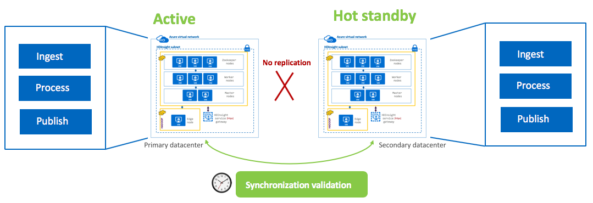
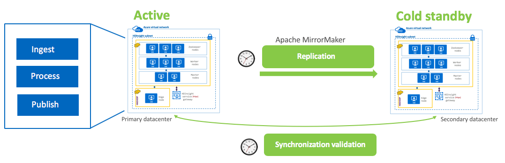
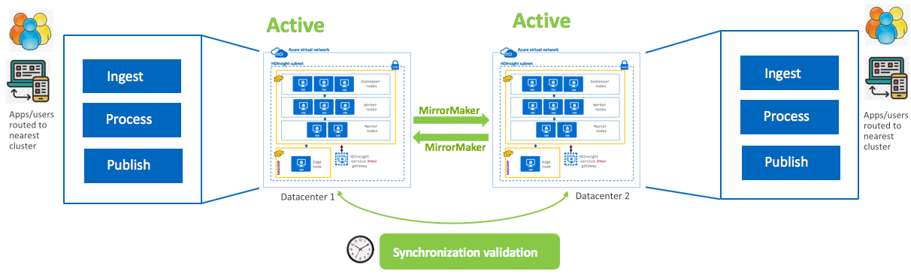
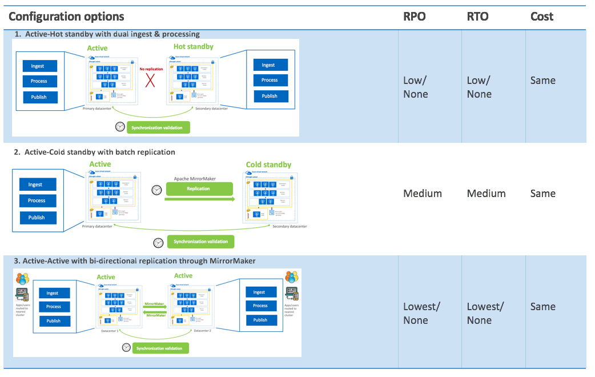

# High Availability and Disaster Recovery for HDInsight Kafka - Considerations

The following documentation covers Disaster Recovery for HDInsight-Kafka.

[High Availability](README.md#1--high-availability) 
[Disaster Recovery](DisasterRecovery.md#2--disaster-recovery)
- [2.0.1. What is your SLA for Disaster Recovery?](DisasterRecovery.md#201-what-is-your-sla-for-disaster-recovery)
- [2.0.2. What to replicate?](DisasterRecovery.md#202-what-to-replicate)
- [2.0.3. Replication to DR - options](DisasterRecovery.md#203-replication-to-dr---options)
  - [2.0.3.1. Active - Hot standby with dual ingest and processing](DisasterRecovery.md#2031-active---hot-standby-with-dual-ingest-and-processing)
  - [2.0.3.2. Active- cold standby with batch replication](DisasterRecovery.md#2032-active--cold-standby-with-batch-replication)
  - [2.0.3.3. Active-Active (bi-directional replication) with Apache MirrorMaker](DisasterRecovery.md#2033-active-active-bi-directional-replication-with-apache-mirrormaker)
- [2.0.4. Comparing the options](DisasterRecovery.md#204-comparing-the-options)
- [2.0.5. Replication tooling & considerations, specific to HDInsight](DisasterRecovery.md#205-replication-tooling--considerations-specific-to-hdinsight)
  - [2.0.5.1. Apache MirrorMaker](DisasterRecovery.md#2051-apache-mirrormaker)
- [2.0.6. Networking considerations](DisasterRecovery.md#206-networking-considerations)
  - [2.0.6.1. Both datacenters on Azure](DisasterRecovery.md#2061-both-datacenters-on-azure)
- [2.0.7. Show me, step-by-step, how Kafka replication is done on Azure across datacenters](DisasterRecovery.md#207-show-me-step-by-step-how-kafka-replication-is-done-on-azure-across-datacenters)

## 2.  Disaster Recovery

### 2.0.1. What is your SLA for Disaster Recovery?
The SLA for disaster recovery can be covered under two popular acronyms -
RTO - Recoverty Time Objective
The targeted duration of time and a service level within which a business process must be restored after a disaster (or disruption) in order to avoid unacceptable consequences associated with a break in business continuity.
RPO - Recovery Point Objective
A recovery point objective (RPO) is defined by business continuity planning. It is the maximum targeted period in which data might be lost from an IT service due to a major incident.

The RPO and RTO requirements (and needless to say, your budget) drive the DR architecture for your HDInsight solution.

### 2.0.2. What to replicate?
Topics and associated events.

### 2.0.3. Replication to DR - options

#### 2.0.3.1. Active - Hot standby with dual ingest and processing

- Applications/integration processes write to Kafka on both clusters
- Both clusters run identical batch jobs and processes to consumer from Kafka
- Standby cluster is offline for reads by applications and end users
- Synchronization tasks need to be run to ensure data is in sync in destination store
- RPO => Low/None | RTO => Low/None | Cost => High
  

#### 2.0.3.2. Active- cold standby with batch replication

- Applications write to Kafka on the active-primary ONLY
- Replication to DR Kafka cluster is incremental, batch, scheduled with Apache MirrorMaker
- Synchronization tasks need to be run to ensure data is in sync in destination store
- RPO => Medium | RTO => Medium | Cost => High
  

#### 2.0.3.3. Active-Active (bi-directional replication) with Apache MirrorMaker

- Applications/integration processes publish to/consume from nearest Kafka
- Both clusters run identical processing
- Synchronization tasks need to be run to ensure data is in sync in destination store
- RPO => Lowest/None | RTO => Lowest/None | Cost => High
  

### 2.0.4. Comparing the options

  

### 2.0.5. Replication tooling & considerations, specific to HDInsight
#### 2.0.5.1. Apache MirrorMaker
This is the defacto Kafka OSS replication utility for Kafka - topic to topic, cluster to cluster.  

### 2.0.6. Networking considerations
#### 2.0.6.1. Both datacenters on Azure
1. Cross region commuication is over private IPs only.
2. Ensure there are no overlapping IP addresses across clusters/ddatacenters
3. Configure global Vnet peering

### 2.0.7. Show me, step-by-step, how Kafka replication is done on Azure across datacenters
[Next](DisasterRecovery.md#207-show-me-step-by-step-how-kafka-replication-is-done-on-azure-across-datacenters)

### Diagrams
Want to take the diagrams and customize? Find the PowerPoint deck [here](images/DR-Architecture-Options.pptx), with the diagrams in it.
