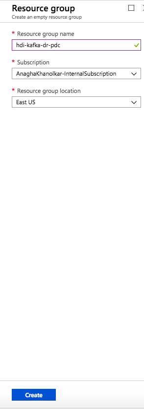
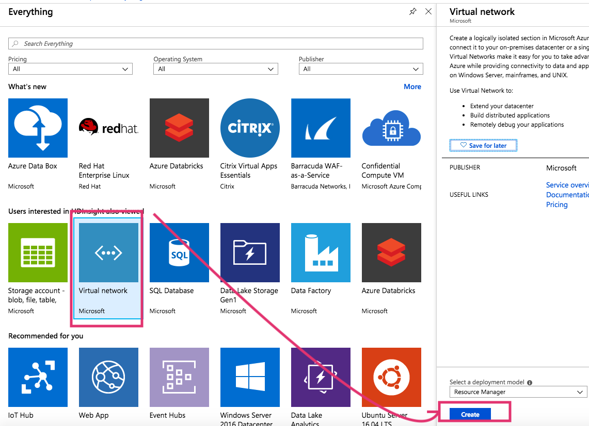
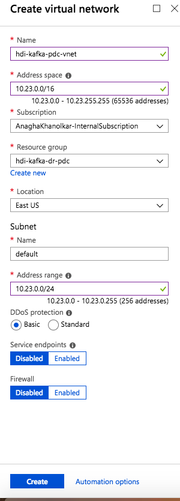

# HDInsight-Kafka: MirrorMaker for replication to DR - by example

This sample covers DR for HDInsight Kafka leveraging MirrorMaker.  In this example, we will provision HDInsight Kafka and dependencies in US East (primary) and US West (secondary).  The following are steps to deploy and configure replication to DR. 

## 1.  Primary datacenter - USEast - setup

### 1.0.1. Provision resource group in USEast
Create a resource group. 

  

### 1.0.2. Provision a virtual network in the resource group

  

  

### 1.0.3. Provision Kafka within the resource group and virtual network created

  

  

  

  

  

  

  

## 2.  Secondary datacenter - USWest - setup
Repeat the steps above in US West datacenter- 
1.  Create resource group 
2.  Within the resource group, create a virtual network with a different IP address space that the primary 
3.  Provision Kafka in the resource group and virtual network created

## 3.  Configure Global Vnet Peering
We will now peer the virtual networks of the primary and secondary datacenters.
### 3.0.1. Peer the primary datacenter's vnet to the secondary datacenter's

  

  

  

  

  

  

### 3.0.2. Peer the secondary datacenter's vnet to the primary datacenter's

  

  

  

