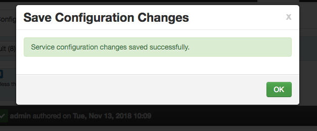

# HDInsight-Kafka: MirrorMaker for replication to DR - by example

This sample covers DR for HDInsight Kafka leveraging MirrorMaker.  In this example, we will provision HDInsight Kafka and dependencies in US East (primary) and US West (secondary).  The following are steps to deploy and configure replication to DR.<br>

## 1.  Primary datacenter - USEast - setup

### 1.0.1. Provision resource group in USEast
Create a resource group.<br>

<br><br>
<hr>


<hr>

### 1.0.2. Provision a virtual network in the resource group

<br><br>
<hr>


<br><br>
<hr>

### 1.0.3. Provision Kafka within the resource group and virtual network created

<br><br>
<hr>


<br><br>
<hr>


<br><br>
<hr>


<br><br>
<hr>


<br><br>
<hr>


<br><br>
<hr>


<br><br>
<hr>

## 2.  Secondary datacenter - USWest - setup
Repeat the steps above in US West datacenter-<br>
1.  Create resource group<br>
2.  Within the resource group, create a virtual network with a different IP address space that the primary<br>
3.  Provision Kafka in the resource group and virtual network created

## 3.  Configure Global Vnet Peering
We will now peer the virtual networks of the primary and secondary datacenters.
### 3.0.1. Peer the primary datacenter's vnet to the secondary datacenter's

<br><br>
<hr>


<br><br>
<hr>


<br><br>
<hr>


<br><br>
<hr>


<br><br>
<hr>


<br><br>
<hr>

### 3.0.2. Peer the secondary datacenter's vnet to the primary datacenter's


<br><br>
<hr>


<br><br>
<hr>


<br><br>
<hr>

## 4.  Configure Kafka to broadcast private IP addresses and listen on all network interfaces 
### 4.0.1. Primary datacenter - configure IP advertising
By default, Zookeeper returns the domain name of the Kafka brokers to clients - not resolvable by entities outside the cluster. Follow the steps below to configure IP advertising.<br>


<br><br>
<hr>


<br><br>
<hr>


<br><br>
<hr>


<br><br>
<hr>


<br><br>
<hr>


<br><br>
<hr>
Paste this at the bottom of the kafka-env section:<br>
```
# Configure Kafka to advertise IP addresses instead of FQDN
IP_ADDRESS=$(hostname -i)
echo advertised.listeners=$IP_ADDRESS
sed -i.bak -e '/advertised/{/advertised@/!d;}' /usr/hdp/current/kafka-broker/conf/server.properties
echo "advertised.listeners=PLAINTEXT://$IP_ADDRESS:9092" >> /usr/hdp/current/kafka-broker/conf/server.properties
```

<br><br>
<hr>


<br><br>
<hr>


<br><br>
<hr>

### 4.0.2. Primary datacenter - configure listener
Configure Kafka to listen on all network interfaces-<br>


<br><br>
<hr>

Replace the listener configuration with this:<br>
```
PLAINTEXT://0.0.0.0:9092 
```


<br><br>
<hr>


<br><br>
<hr>


<br><br>
<hr>

### 4.0.3. Primary datacenter - restart Kafka
Restart Kafka-<br>


<br><br>
<hr>


<br><br>
<hr>


<br><br>
<hr>


<br><br>
<hr>


### 4.0.4. Make note of the broker IP addresses

<br><br>
<hr>

### 4.0.5. Secondary datacenter - repeat 4.0.[1-4]
1.  Configure Kafka for IP advertising
2.  Configure listener to listen on all network interfaces
3.  Restart Kafka
4.  Make a note of the broker IP addresses

## 5.  Setup in primary Kafka cluster
### 5.0.1. SSH into cluster

### 5.0.2. Create Kafka topic

### 5.0.3. Create consumer properties 

### 5.0.4. Create producer properties 

## 6.  Setup in secondary Kafka cluster
### 6.0.1. SSH into cluster

### 6.0.2. Create Kafka topic

### 6.0.3. Create consumer properties 

### 6.0.4. Create producer properties 

## 7.  Start MirrorMaker

## 8.  Test MirrorMaker
### 8.0.1. Launch console producer in primary Kafka cluster 

### 8.0.2. Launch console consumer in secondary Kafka cluster 

### 8.0.3. Validate replication by keying in some data in the producer in primary Kafka cluster 

### 8.0.3. Validate replication by viewing the console consumer in secondary Kafka cluster 
