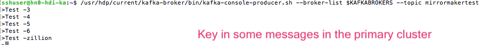

# HDInsight-Kafka: MirrorMaker for replication to DR - by example

This sample covers DR for HDInsight Kafka leveraging MirrorMaker.  In this example, we will provision HDInsight Kafka and dependencies in US East (primary) and US West (secondary).  The following are steps to deploy clusters, configure replication to DR and test the replication.<br>

[Summary](MirrorMakerLab.md#long-story-short)<br>
[1. Primary datacenter - USEast - setup](MirrorMakerLab.md#1--primary-datacenter---useast---setup)<br>
[1.0.1. Provision resource group in USEast](MirrorMakerLab.md#101-provision-resource-group-in-useast)<br>
[1.0.2. Provision a virtual network in the resource group](MirrorMakerLab.md#102-provision-a-virtual-network-in-the-resource-group)<br>
[1.0.3. Provision Kafka within the resource group and virtual network created](MirrorMakerLab.md#103-provision-kafka-within-the-resource-group-and-virtual-network-created)<br>
[2. Secondary datacenter - USWest - setup](MirrorMakerLab.md#2--secondary-datacenter---uswest---setup)<br>
[3. Configure Global Vnet Peering](MirrorMakerLab.md#3--configure-global-vnet-peering)<br>
[3.0.1. Peer the primary datacenter's vnet to the secondary datacenter's](MirrorMakerLab.md#301-peer-the-primary-datacenters-vnet-to-the-secondary-datacenters)<br>
[3.0.2. Peer the secondary datacenter's vnet to the primary datacenter's](MirrorMakerLab.md#302-peer-the-secondary-datacenters-vnet-to-the-primary-datacenters)<br>
[4. Configure Kafka to broadcast private IP addresses and listen on all network interfaces](MirrorMakerLab.md#4--configure-kafka-to-broadcast-private-ip-addresses-and-listen-on-all-network-interfaces)<br>
[4.0.1. Primary datacenter - configure IP advertising](MirrorMakerLab.md#401-primary-datacenter---configure-ip-advertising)<br>
[4.0.2. Primary datacenter - configure listener](MirrorMakerLab.md#402-primary-datacenter---configure-listener)<br>
[4.0.3. Primary datacenter - restart Kafka](MirrorMakerLab.md#403-primary-datacenter---restart-kafka)<br>
[4.0.4. Make note of the IP addresses](MirrorMakerLab.md#404-make-note-of-the-ip-addresses)<br>
[4.0.5. Secondary datacenter - repeat 4.0.[1-4]](MirrorMakerLab.md#405-secondary-datacenter---repeat-401-4)<br>
[5. Setup in primary Kafka cluster](MirrorMakerLab.md#5--setup-in-primary-kafka-cluster)<br>
[5.0.1. SSH into cluster](MirrorMakerLab.md#501-ssh-into-cluster)<br>
[5.0.2. Create Kafka topic](MirrorMakerLab.md#502-create-kafka-topic)<br>
[6. Setup in secondary Kafka cluster](MirrorMakerLab.md#6--setup-in-secondary-kafka-cluster)<br>
[6.0.1. SSH into cluster](MirrorMakerLab.md#601-ssh-into-cluster)<br>
[6.0.2. Create Kafka topic](MirrorMakerLab.md#602-create-kafka-topic)<br>
[7. MirrorMaker specific setup in the secondary Kafka cluster](MirrorMakerLab.md#7--mirrormaker-specific-setup-in-the-secondary-kafka-cluster)<br>
[7.0.1. Create consumer properties file to be passed to MirrorMaker](MirrorMakerLab.md#701-create-consumer-properties-file-to-be-passed-to-mirrormaker)<br>
[7.0.2. Create producer properties to be passed to MirrorMaker](MirrorMakerLab.md#702-create-producer-properties-to-be-passed-to-mirrormaker)<br>
[8. Start MirrorMaker in the secondary Kafka cluster](MirrorMakerLab.md#8--start-mirrormaker-in-the-secondary-kafka-cluster)<br>
[9. Test MirrorMaker](MirrorMakerLab.md#9--test-mirrormaker)<br>
[9.0.1. Launch console producer in primary Kafka cluster](MirrorMakerLab.md#901-launch-console-producer-in-primary-kafka-cluster)<br>
[9.0.2. Launch console consumer in secondary Kafka cluster](MirrorMakerLab.md#902-launch-console-consumer-in-secondary-kafka-cluster)<br>
[9.0.3. Validate replication by keying in some data in the producer in primary Kafka cluster](MirrorMakerLab.md#903-validate-replication-by-keying-in-some-data-in-the-producer-in-primary-kafka-cluster)<br>
[9.0.4. Validate replication by viewing the console consumer in secondary Kafka cluster](MirrorMakerLab.md#904-validate-replication-by-viewing-the-console-consumer-in-secondary-kafka-cluster)<br>

<hr>

## Long story short
To replicate to DR with Mirrormaker-
1.  Create two identical clusters in two separate datacenters with non-overlapping IP address spaces
2.  Configure global Vnet peering for the Vnets hosting the two clusters (Azure DNS will do).
3.  Enable both clusters to braodcast IP addresses
4.  Enable both clusters to listen on all network interfaces
5.  On the secondary cluster-
  - (i) Create a producer.properties file that lists secondary cluster bootstrap servers with port
  - (ii) Create a consumer.properties file that lists primary cluster's zookeeper servers with port and consumer group 
  - (iii) Launch MirrorMaker with the two properties files, topic name and relevant parameters
  - AND you are good to go
  - (iv) In the lab - we will launch a console producer in the primary and key in some messages
  - AND
  - (v) Launch console consumer in the secondary cluster and watch the messages replicated displayed on the console.

## 1.  Primary datacenter - USEast - setup

### 1.0.1. Provision resource group in USEast
Create a resource group.<br>

<br><br>
<hr>


<hr>

### 1.0.2. Provision a virtual network in the resource group

<br><br>
<hr>


<br><br>
<hr>

### 1.0.3. Provision Kafka within the resource group and virtual network created

<br><br>
<hr>


<br><br>
<hr>


<br><br>
<hr>


<br><br>
<hr>


<br><br>
<hr>


<br><br>
<hr>


<br><br>
<hr>

## 2.  Secondary datacenter - USWest - setup
Repeat the steps above in US West datacenter-<br>
1.  Create resource group<br>
2.  Within the resource group, create a virtual network with a different IP address space that the primary<br>
3.  Provision Kafka in the resource group and virtual network created

## 3.  Configure Global Vnet Peering
We will now peer the virtual networks of the primary and secondary datacenters.
### 3.0.1. Peer the primary datacenter's vnet to the secondary datacenter's

<br><br>
<hr>


<br><br>
<hr>


<br><br>
<hr>


<br><br>
<hr>


<br><br>
<hr>


<br><br>
<hr>

### 3.0.2. Peer the secondary datacenter's vnet to the primary datacenter's


<br><br>
<hr>


<br><br>
<hr>


<br><br>
<hr>

## 4.  Configure Kafka to broadcast private IP addresses and listen on all network interfaces 
### 4.0.1. Primary datacenter - configure IP advertising
By default, Zookeeper returns the domain name of the Kafka brokers to clients - not resolvable by entities outside the cluster. Follow the steps below to configure IP advertising.<br>


<br><br>
<hr>


<br><br>
<hr>


<br><br>
<hr>


<br><br>
<hr>


<br><br>
<hr>


<br><br>
<hr>
Paste this at the bottom of the kafka-env section:<br>
```
# Configure Kafka to advertise IP addresses instead of FQDN
IP_ADDRESS=$(hostname -i)
echo advertised.listeners=$IP_ADDRESS
sed -i.bak -e '/advertised/{/advertised@/!d;}' /usr/hdp/current/kafka-broker/conf/server.properties
echo "advertised.listeners=PLAINTEXT://$IP_ADDRESS:9092" >> /usr/hdp/current/kafka-broker/conf/server.properties
```

<br><br>
<hr>


<br><br>
<hr>


<br><br>
<hr>

### 4.0.2. Primary datacenter - configure listener
Configure Kafka to listen on all network interfaces-<br>


<br><br>
<hr>

Replace the listener configuration with this:<br>
```
PLAINTEXT://0.0.0.0:9092 
```


<br><br>
<hr>


<br><br>
<hr>


<br><br>
<hr>

### 4.0.3. Primary datacenter - restart Kafka
Restart Kafka-<br>


<br><br>
<hr>


<br><br>
<hr>


<br><br>
<hr>


<br><br>
<hr>


### 4.0.4. Make note of the IP addresses

<br><br>
<hr>

### 4.0.5. Secondary datacenter - repeat 4.0.[1-4]
1.  Configure Kafka for IP advertising
2.  Configure listener to listen on all network interfaces
3.  Restart Kafka
4.  Make a note of the broker IP addresses

## 5.  Setup in primary Kafka cluster
### 5.0.1. SSH into cluster

<br><br>
<hr>


<br><br>
<hr>


<br><br>
<hr>

### 5.0.2. Create Kafka topic

5.0.2.1. Create and populate cluster name into a variable<br>

```
read -p "Enter the Kafka on HDInsight cluster name: " CLUSTERNAME
```

<br>

5.0.2.2. Install jq to process json easily<br>

```
sudo apt -y install jq
```

<br>

5.0.2.3. Get zookeeper list into a variable<br>

```
export KAFKAZKHOSTS=`curl -sS -u admin -G https://$CLUSTERNAME.azurehdinsight.net/api/v1/clusters/$CLUSTERNAME/services/ZOOKEEPER/components/ZOOKEEPER_SERVER | jq -r '["\(.host_components[].HostRoles.host_name):2181"] | join(",")' | cut -d',' -f1,2`
```

<br>
Validate:<br>

```
echo $KAFKAZKHOSTS
```

<br>
5.0.2.4. Create a topic<br>

```
/usr/hdp/current/kafka-broker/bin/kafka-topics.sh --create --replication-factor 3 --partitions 3 --topic mirrormakertest --zookeeper $KAFKAZKHOSTS
```
You should see a message that states that the topic was created.
<br>


## 6.  Setup in secondary Kafka cluster
Repeat the steps performed in section 5 in the secondary Kafka cluster.  Be sure to use the same topic name in both clusters for the lab - preferably follow instructions verbatim except for IP address and cluster names.

### 6.0.1. SSH into cluster
Navigate to the portal, get the SSH command to connect to the cluster and SSH to the headnode.

### 6.0.2. Create Kafka topic
6.0.2.1. Create and populate cluster name into a variable<br>

```
read -p "Enter the Kafka on HDInsight cluster name: " CLUSTERNAME
```

<br>

6.0.2.2. Install jq to process json easily<br>

```
sudo apt -y install jq
```

<br>

6.0.2.3. Get broker list into a variable<br>

```
export KAFKABROKERS=`curl -sS -u admin -G https://$CLUSTERNAME.azurehdinsight.net/api/v1/clusters/$CLUSTERNAME/services/KAFKA/components/KAFKA_BROKER | jq -r '["\(.host_components[].HostRoles.host_name):9092"] | join(",")' | cut -d',' -f1,2`
```

<br>
Validate:<br>

```
echo $KAFKABROKERS
```

<br>

6.0.2.4. Get zookeeper list into a variable<br>

```
export KAFKAZKHOSTS=`curl -sS -u admin -G https://$CLUSTERNAME.azurehdinsight.net/api/v1/clusters/$CLUSTERNAME/services/ZOOKEEPER/components/ZOOKEEPER_SERVER | jq -r '["\(.host_components[].HostRoles.host_name):2181"] | join(",")' | cut -d',' -f1,2`
```

<br>
Validate:<br>

```
echo $KAFKAZKHOSTS
```

<br>
6.0.2.5. Create a topic<br>

```
/usr/hdp/current/kafka-broker/bin/kafka-topics.sh --create --replication-factor 3 --partitions 3 --topic mirrormakertest --zookeeper $KAFKAZKHOSTS
```

<br>

## 7.  MirrorMaker specific setup in the **secondary** Kafka cluster

### 7.0.1. Create consumer properties file to be passed to MirrorMaker
In the Linux terminal, in a SSH session, create a file called consumer.properties and paste the below into it;  Replace zookeeper IPs with your **primary** Kafka cluster zookeeper private IPs-<br>

```
zookeeper.connect=10.23.0.11:2181,10.23.0.7:2181,10.23.0.9:2181
group.id=mirrorgroup
```

<br>
<hr>

### 7.0.2. Create producer properties to be passed to MirrorMaker 

In the Linux terminal, in a SSH session, create a file called producer.properties and paste the below into it;  Replace bootstrap server/broker IPs with your **secondary** Kafka cluster broker IPs-<br>

```
bootstrap.servers=10.24.0.4:9092,10.24.0.6:9092,10.24.0.14:9092
compression.type=none
```

## 8.  Start MirrorMaker in the **secondary** Kafka cluster
In the secondary cluster SSH terminal, from the Linux command line, run the following command to start MirrorMaker.  Keep this command runnning for the duration of the lab.  Modify number of streams as needed and makes sense.<br>

```
/usr/hdp/current/kafka-broker/bin/kafka-run-class.sh kafka.tools.MirrorMaker --consumer.config consumer.properties --producer.config producer.properties --whitelist mirrormakertest --num.streams 3
```

## 9.  Test MirrorMaker
### 9.0.1. Launch console producer in **primary** Kafka cluster 

Open a new SSH terminal for th secondary cluster and run the below-<br>

9.0.1.1. Create and populate cluster name into a variable<br>

```
read -p "Enter the Kafka on HDInsight cluster name: " CLUSTERNAME
```

<br>
9.0.1.2. Get the Kafka brokers into a variable-<br>

```
export KAFKABROKERS=`curl -sS -u admin -G https://$CLUSTERNAME.azurehdinsight.net/api/v1/clusters/$CLUSTERNAME/services/KAFKA/components/KAFKA_BROKER | jq -r '["\(.host_components[].HostRoles.host_name):9092"] | join(",")' | cut -d',' -f1,2`
```

<br>
9.0.2.3. Launch the console consumer-<br>

```
/usr/hdp/current/kafka-broker/bin/kafka-console-producer.sh --broker-list $KAFKABROKERS --topic mirrormakertest
```

<br>

### 9.0.2. Launch console consumer in **secondary** Kafka cluster 
Open a new SSH terminal for th secondary cluster and run the below-<br>

9.0.2.1. Create and populate cluster name into a variable<br>

```
read -p "Enter the Kafka on HDInsight cluster name: " CLUSTERNAME
```

<br>
9.0.2.2. Get the Kafka brokers into a variable-<br>

```
export KAFKABROKERS=`curl -sS -u admin -G https://$CLUSTERNAME.azurehdinsight.net/api/v1/clusters/$CLUSTERNAME/services/KAFKA/components/KAFKA_BROKER | jq -r '["\(.host_components[].HostRoles.host_name):9092"] | join(",")' | cut -d',' -f1,2`
```

<br>
9.0.2.3. Launch the console consumer-<br>

```
/usr/hdp/current/kafka-broker/bin/kafka-console-consumer.sh --topic mirrormakertest --from-beginning --bootstrap-server $KAFKABROKERS
```

<br>

### 9.0.3. Validate replication by keying in some data in the producer in **primary** Kafka cluster 

In the primary cluster, from the producer console, key in some messages.
<br>

<br><br>
You should see them in the destination DR cluster's console consumer rightaway.<br>

<hr>

### 9.0.4. Validate replication by viewing the console consumer in **secondary** Kafka cluster 

You should see the messages keyed in source/primary cluster's console producer in the DR cluster console consumer.<br>


<br><br>
<hr>
This concludes the lab.
