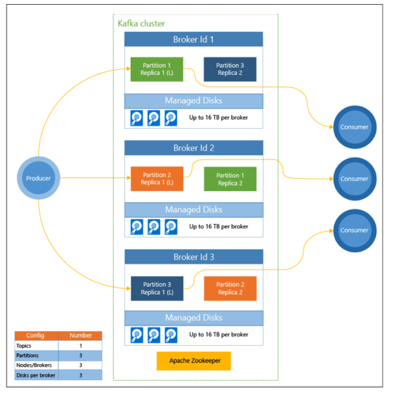

# High Availability and Disaster Recovery for HDInsight Kafka - Considerations

HDInsight Kafka is Azure's Hortonworks distribution based managed Kafka as a service.  You can find an overview in [PPTX](https://github.com/anagha-microsoft/hdi-kafka-dr/blob/master/decks/HDInsight-Kafka-Overview-v1.0.pptx) and [PDF](https://github.com/anagha-microsoft/hdi-kafka-dr/blob/master/decks/HDInsight-Kafka-Overview-v1.0.pdf).  The following documentation covers High Availability and Disaster Recovery for HDInsight-Kafka.

[1. High Availability](README.md#1--high-availability) 
[2. Disaster Recovery](DisasterRecovery.md) 
[3. Hands-on lab for cross-datacenter replication with Apache MirrorMaker](MirrorMakerLab.md)

## 1.  High Availability
To level-set, high-availability as referenced in this section has to do with *fault tolerance within the same datacenter*. 
Acronyms used: 
HA => High Availability 
FT => Fault tolerance  
  
**HDInsight cluster topology:**
 

 

**HDInsight - broker, partitions, replicas:**
 

 

**Architectural considerations:**
 
When planning HA for HDInsight Kafka, the following are some considerations: 
1.  Is the storage infrastructure HA?
2.  Is the compute infrastructure HA?
3.  Is the HDInsight cluster management service (Ambari) HA?
4.  Is Zookeeper count adequate and is it configured HA (update/fault domain configured)?
5.  Is HDInsight service, monitoring and self-healing my brokers?
6.  Are my replicas configured for HA?
The following address these considerations and more. 

### 1.0.1. HDInsight platform infrastructure - storage
HDInsight Kafka leverages Azure managed disks for storage.  At provision-time you can choose between premium and standard managed disks. 

**Managed disks:** 
By defaut - Azure storage service maintains 3 copies of each disk in the cluster, within the datacenter, across fault and update domains.  In the event of a failure, a replica is served uo seamlessly.  

### 1.0.2. HDInsight platform infrastructure - compute
Azure VMs have an SLA, as do HDInsight master and worker nodes.  To maintain the SLA, the HDInsight service actively montors the health of the nodes and replaces failied nodes automatically.  For the highest fault tolerance HDInsight places nodes across fault and update domains intelligently.

### 1.0.3. Hadoop service component - master nodes
Although Kafka has a amsteless architecture, the management and monitoring services  in Hadoop like Ambari need to be configured HA.  For HA, HDInsight comes with two master nodes, in active and standby mode for maximizing FT.  The same are provisioned intelligently for FT across fault and update domains.

### 1.0.4. Hadoop service component - Zookeeper
Zookeeper is a distributed coordination service and is a foundational service.  HDInsight leverages 3 Zookeeper servers - the minimum recommended for HA.

### 1.0.5. Hadoop service component - Ambari
Ambari is configured HA across the two master nodes.

### 1.0.6. Kafka framework service component - Brokers
The Kafka framework through heartbeating keeps track of brokers that are alive.  If a broker goes down, the framework blacklists the broker, detects under-replication of logs and starts replicating to a different broker or set of brokers.  

### 1.0.7. HDInsight platform service - Brokers
The HDInight service monitors the brokers for outages or any issues and initiates and completes self-healing to ensure cluster health to stay within the promised service SLA.

### 1.0.8. Kafka framework component - replica placement with rack awareness 
In Azure, the equaivalent of intelligent replica-placement with rack-awareness is spreading replicas across fault and update domains. 

Kafka does not do this automatically.  HDInsight Kafka provides a partition rebalancing utility to manage intelligent replica placement across fault and update domains and its available at - 
https://github.com/hdinsight/hdinsight-kafka-tools
 
**When does this need to be run?** 
- When a new topic is created or partition is scaled
- When you scale up a cluster by adding brokers

**Considerations WRT fault domains:** 
*Zookeeper is a critical dependency for Kafka, and should be deploying in multiples of odd numbers across fault and update domains, with a minimum of 3.* 

But... there are some datacenters with only two fault domains.  Consider avoiding Kafka in these datacenters if at all possible, and if you cant, increase topic replication to 4.

### 1.0.9. What about when I am writing/reading from Kafka and a broker hosting my leader partition replica goes down?
The framework manages redirection to a different replica.  Consider adding retries in your application code.

## 2.  Disaster Recovery
[Next](https://github.com/anagha-microsoft/hdi-kafka-dr/blob/master/DisasterRecovery.md)
