# Setting up DR for HDInsight kafka, by example

This sample covers DR for HDInsight Kafka through open source utility Apache Mirrormaker. 
In this example, we will provision Kafka and dependencies in US East 2 and US West 2.  The following are steps to deploy and configure replication to DR. 

## 1.  Primary datacenter - USEast2 - setup

### 1.0.1. Provision resource group in USEast2
Create a resource group. 
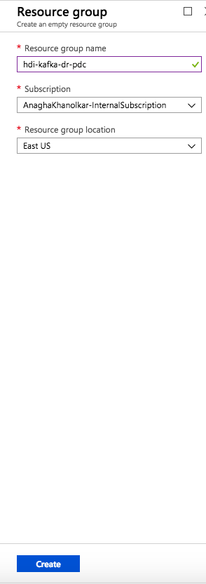
  
### 1.0.2. Provision a virtual network
Create a virtual network as described below in the resource group created. 
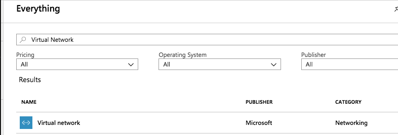
  
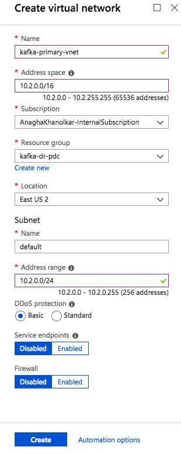
  
### 1.0.3. Provision a Windows server in USEast2 in the resource group
One of the dependencies for cross datacenter connectivity is leveraging custom DNS service per cluster.  For this, we will use a Windows server with DNS enabled.  
  

  
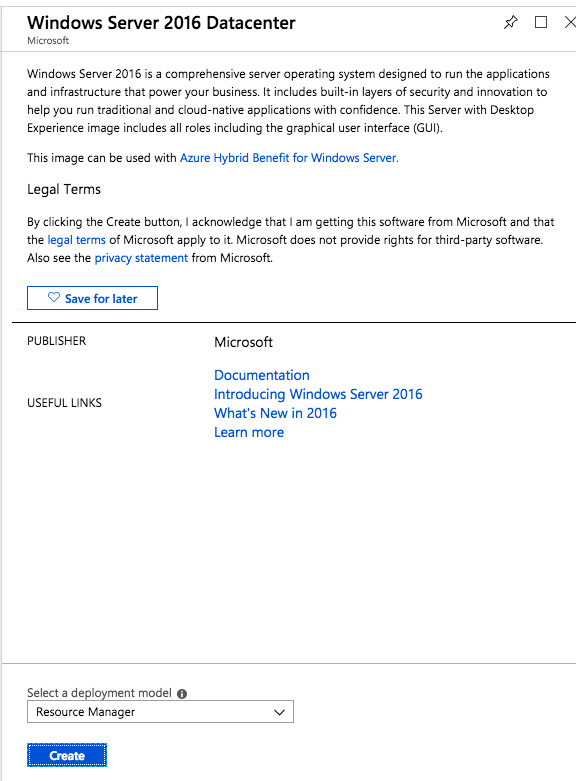
  
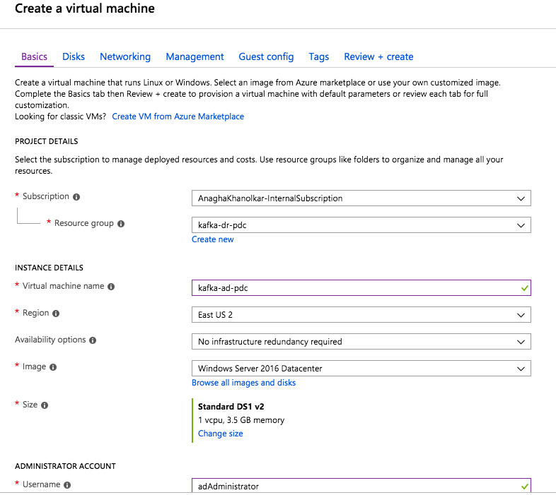
  
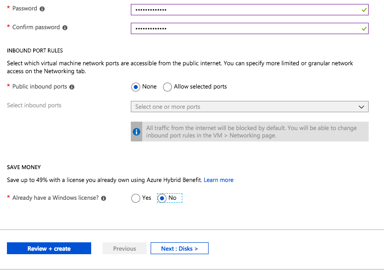
  
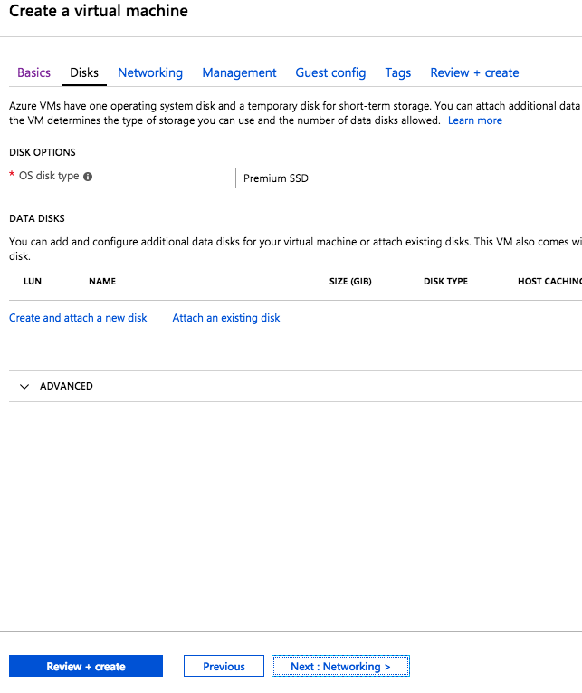
  
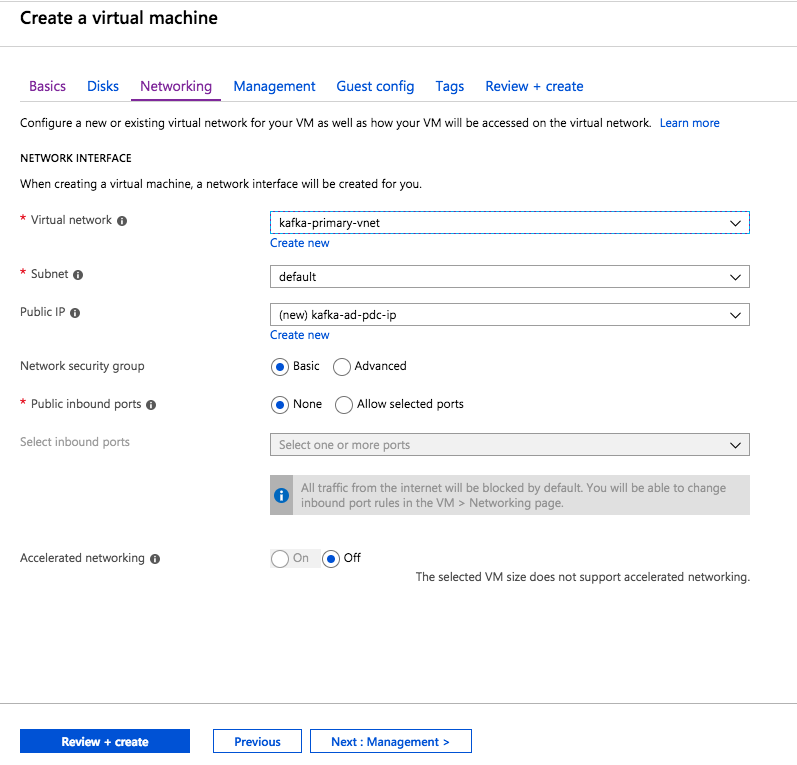
  
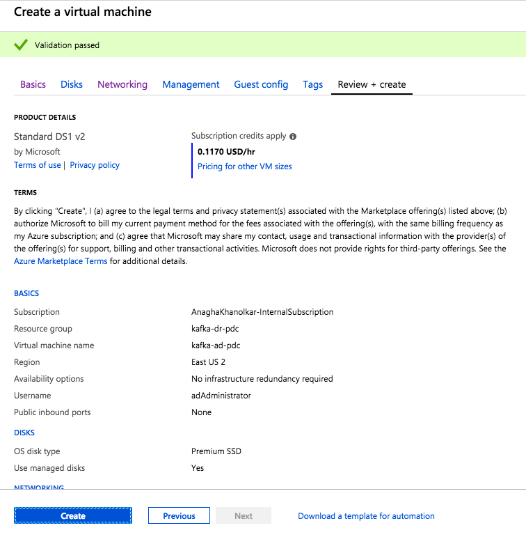
  
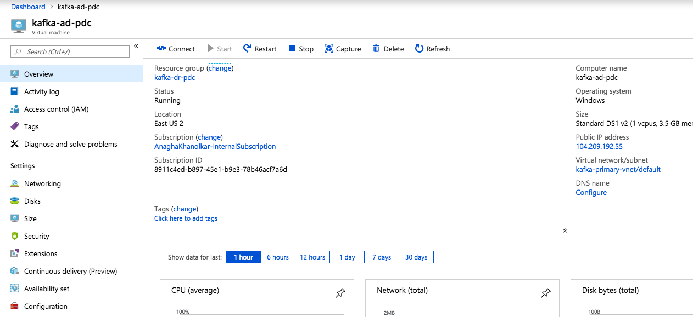
  
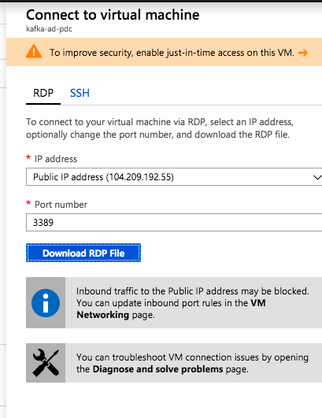
  

### 1.0.3. Provision a virtual network for Kafka

### 1.0.4. Peer the Kafka Vnet with the VNet with AD in it

### 1.0.5. Enable DNS service in AD

### 1.0.6. Configure the Kafka Vnet to use the DNS service in AD

### 1.0.7. Provision HDInsight Kafka in the Kafka Vnet

### 1.0.8. Enable IP advertising in Kafka

### 1.0.9. Configure Kafka to listen on all network interfaces

### 1.0.10. Restart Kafka

## 2.  Primary datacenter - USWest2 - setup

### 2.0.1. Provision resource group in USWest2

### 2.0.2. Provision Active Directory in USWest2 in the resource group

### 2.0.3. Provision a virtual network for Kafka

### 2.0.4. Peer the Kafka Vnet with the VNet with AD in it

### 2.0.5. Enable DNS service in AD

### 2.0.6. Configure the Kafka Vnet to use the DNS service in AD

### 2.0.7. Provision HDInsight Kafka in the Kafka Vnet

### 2.0.8. Enable IP advertising in Kafka

### 2.0.9. Configure Kafka to listen on all network interfaces

### 2.0.10. Restart Kafka
